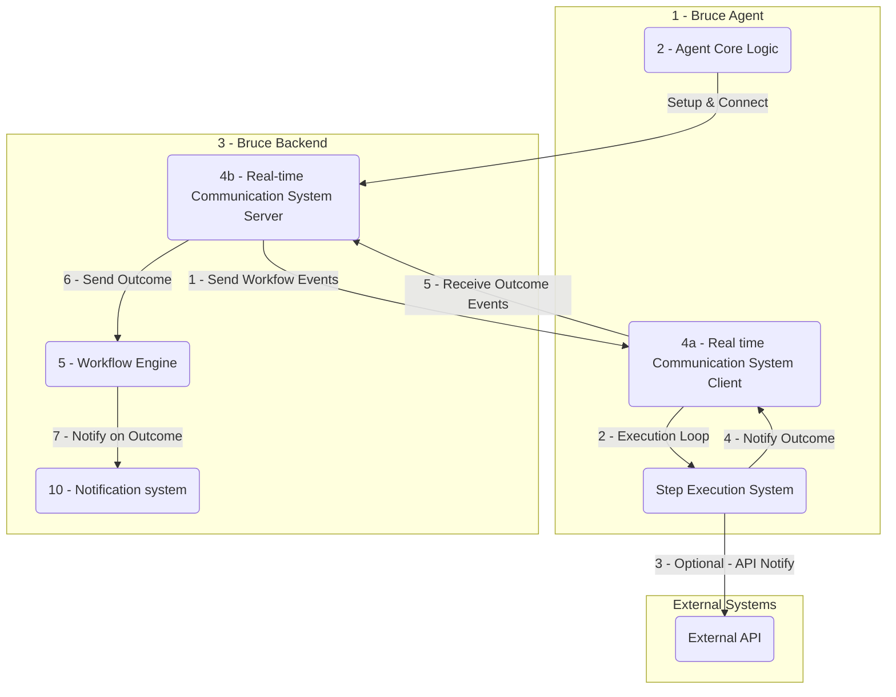

```mermaid
flowchart TD
    subgraph "1 - Bruce Agent"
        BA_Logic("2 - Agent Core Logic")
        BA_Steps("Step Execution System")
        BA_Comms("4a - Real time Communication System Client")
    end

    subgraph "3 - Bruce Backend"
        BB_Comms("4b - Real-time Communication System Server")
        BB_WF("5 - Workflow Engine")
        BB_Notify("10 - Notification system")
    end

    subgraph "External Systems"
        External_Endpoint("External API")
    end

    BA_Logic --> |Setup & Connect| BB_Comms
    BB_Comms --> |1 - Send Workfow Events| BA_Comms
    BA_Comms --> |2 - Execution Loop| BA_Steps
    BA_Steps --> |4 - Notify Outcome| BA_Comms
    BA_Comms --> |5 - Receive Outcome Events|BB_Comms
    BB_Comms --> |6 - Send Outcome| BB_WF
    BB_WF --> |7 - Notify on Outcome|BB_Notify
    BA_Steps --> |3 - Optional - API Notify| External_Endpoint
```
