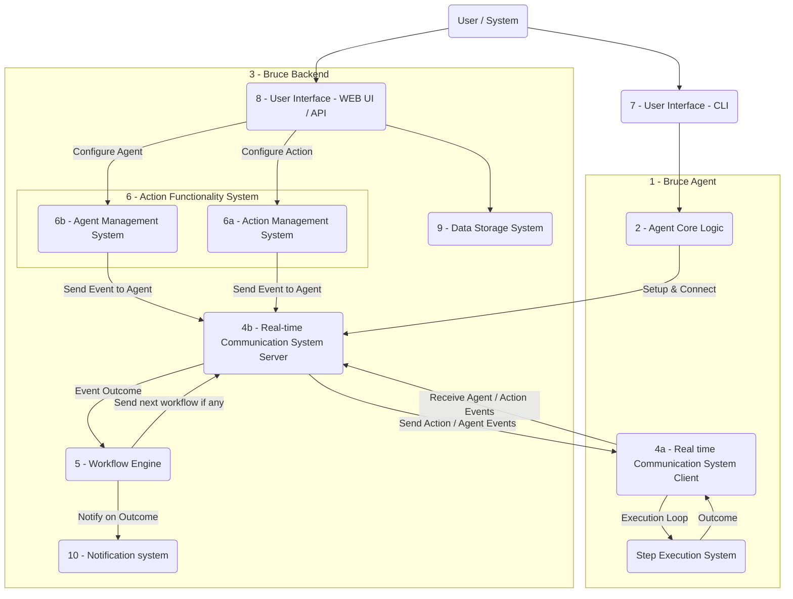

```mermaid
flowchart TD
    User("User / System")
    CLI("7 - User Interface - CLI")

    subgraph "1 - Bruce Agent"
        BA_Logic("2 - Agent Core Logic")
        BA_Steps("Step Execution System")
        BA_Comms("4a - Real time Communication System Client")
    end

    

    subgraph "3 - Bruce Backend"
        BB_WebUI("8 - User Interface - WEB UI / API")
        subgraph "6 - Action Functionality System"
            BB_Actions("6a - Action Management System")
            BB_Agent("6b - Agent Management System")
        end
        BB_Comms("4b - Real-time Communication System Server")
        BB_WF("5 - Workflow Engine")
        BB_Data("9 - Data Storage System")
        BB_Notify("10 - Notification system")
    end

    User --> CLI
    User --> BB_WebUI
    BB_WebUI --> BB_Data
    CLI --> BA_Logic
    BA_Logic --> |Setup & Connect| BB_Comms
    BB_Comms --> |Send Action / Agent Events| BA_Comms
    BA_Comms --> |Execution Loop| BA_Steps
    BA_Steps --> |Outcome| BA_Comms
    BA_Comms --> |Receive Agent / Action Events|BB_Comms
    BB_Comms --> |Event Outcome| BB_WF
    BB_WF --> |Send next workflow if any|BB_Comms
    BB_WF --> |Notify on Outcome|BB_Notify
    BB_Agent --> | Send Event to Agent| BB_Comms
    BB_Actions --> | Send Event to Agent| BB_Comms
    BB_WebUI --> |Configure Agent| BB_Agent
    BB_WebUI --> |Configure Action| BB_Actions
```