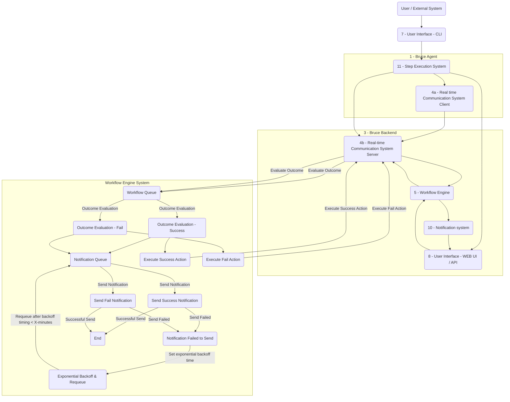

```mermaid
flowchart TD
    User("User / External System")
    CLI("7 - User Interface - CLI")

    subgraph "1 - Bruce Agent"
        BA_Steps("11 - Step Execution System")
        BA_Comms("4a - Real time Communication System Client")
    end

    subgraph "3 - Bruce Backend"
        BB_Comms("4b - Real-time Communication System Server")
        BB_WF("5 - Workflow Engine")
        BB_WebUI("8 - User Interface - WEB UI / API")
        BB_Notify("10 - Notification system")
    end

    User --> CLI
    CLI --> BA_Steps
    BA_Steps --> BA_Comms
    BA_Comms --> BB_Comms
    BB_Comms --> BB_WF
    BA_Steps --> BB_WebUI
    BB_WebUI --> BB_WF
    BB_WF --> BB_Notify
    BB_Notify --> BB_WebUI
    BB_WF --> BB_Comms
    BA_Steps --> BB_Comms

    subgraph "Workflow Engine System"
        WF_Queue("Workflow Queue")
        WF_Success_Outcome("Outcome Evaluation - Success")
        WF_Failure_Outcome("Outcome Evaluation - Fail")
        WF_Notify_Queue("Notification Queue")
        WF_Execute_Success("Execute Success Action")
        WF_Execute_Fail("Execute Fail Action")
        WF_Notify_Success("Send Success Notification")
        WF_Notify_Fail("Send Fail Notification")
        WF_Notify_Recv_Fail("Notification Failed to Send")
        Exponential_Backoff("Exponential Backoff & Requeue")
        End("End")
    end
    WF_Queue --> |Outcome Evaluation | WF_Success_Outcome
    WF_Queue --> |Outcome Evaluation | WF_Failure_Outcome
    WF_Success_Outcome -->  WF_Notify_Queue
    WF_Success_Outcome -->  WF_Execute_Success
    WF_Execute_Success --> |Execute Success Action| BB_Comms
    WF_Notify_Queue --> |Send Notification| WF_Notify_Success
    WF_Notify_Success --> |Successful Send| End
    WF_Notify_Success --> |Send Failed| WF_Notify_Recv_Fail
    WF_Notify_Recv_Fail --> |Set exponential backoff time| Exponential_Backoff
    Exponential_Backoff --> |Requeue after backoff timing < X-minutes| WF_Notify_Queue
    BB_Comms --> |Evaluate Outcome| WF_Queue
    WF_Failure_Outcome -->  WF_Notify_Queue
    WF_Failure_Outcome -->  WF_Execute_Fail
    WF_Execute_Fail --> |Execute Fail Action| BB_Comms
    WF_Notify_Queue --> |Send Notification| WF_Notify_Fail
    WF_Notify_Fail --> |Successful Send| End
    WF_Notify_Fail --> |Send Failed| WF_Notify_Recv_Fail
    BB_Comms --> |Evaluate Outcome| WF_Queue
```